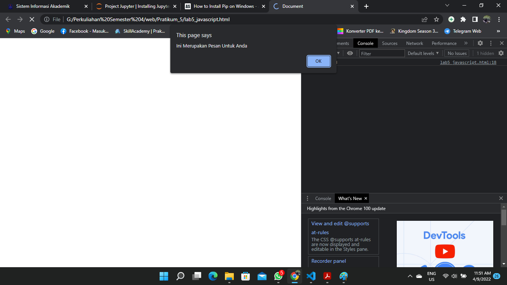
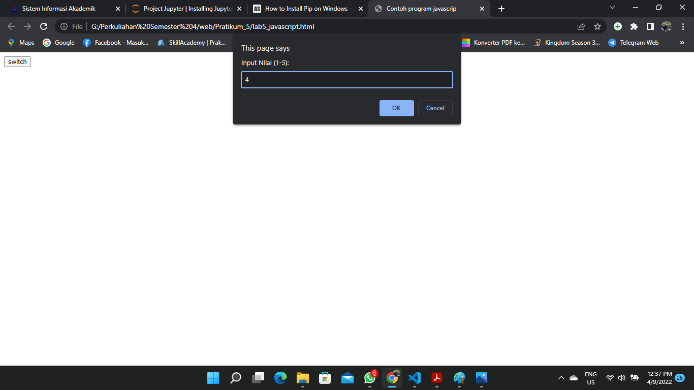

# Pratikum 5 Web

        Nama    : Fajar Firmansyah
        Nim     : 312010309
        Kelas   : TI.20.A2

### Membuat document.write dan console.log

* Fungsi `document.write` untuk menampilkan  data langsung pada halaman web.
* Fungsi  `console.log` untuk menampilkan teks ke console javascrip, biasanya digunakan untuk debugging. Karna setiap pesan yang error akan di tampilkan pada console.

### Membuat window.alert

* Fungsi `window.alert` biasanya digunakan untuk menampilkan sebuah pesan peringatan atau informasi. 

### Menampilkan Popap untuk menginput sebuah Teks

* membuat variabel  dengan `var nama `
* fungsi dari `prompt()` untuk mengambil sebuah inputan dari pengguna, `prompt()` akan mengmbalikan sebuah nilai string dari apa yang dinputkan

### Menampilkan Informasi atau pesan

* fungsi `alert` biasanya digunakan untuk menampilkan sebuah pesan peringatan atau informasi.

### Membuat Perhitungan Arithmetic

* membuat tombol button pada bagian body dan memasukan `onclick=test(9,4).
* `function test(val1,val2)`, test diambil pada bagian onclik lalu `val1 dan val2` menggantikan angka 9 dan 4
* mencetak val1 dan val2 dengan cara `document.write` lalu masukan karakter tambah,kurang,bagi,perkalian, modulus. 

* Ketika Tombol ditekan akan menampilkan hasil dari kode diatas

### Membuat Pernilaian

* membuat variabel nilai dengan tipe `var`
* membuat variable hasil dengan tipe `var`
* membuat kondisi if dan else.
* `if` jika `nilai lebih besar samadengan 60` maka akan menampilkan `hasil = Lulus`
* `else` jika `Nilai lebih kecil dari 60` maka akan menampilkan `hasil = Tidak lulus`
* Menampilkan hasil `document.write("Hasil: " + hasil)`, panggil variabel hasil kedalam write.  

* Ketika menginputkan nilai kurang dari 60 maka akan menampilkan Tidak Lulus.
* Ketika menginputkan nilai lebih besar dari 60 maka akan menampilkan LULUS

### Membuat Looping Switch

* Membuat tombol dengan `onclike=test()`
* memanggil `test` dan membuat variabel baru `(val1)`
* Mesaukan `switch(val1)` memanggil variabel `val1` kedalam switch.
* Jika memilih angka 1 maka akan masukan kedalam  `case "1"` lalu menampilkan isi didalam `case "1"` lalu `break` agar tidak mengeksekusi pada `case` yang ada dibawahnya dan menghentikan program ketika value pada `case` sama dengan yang di harapkan

* Memasukan nilai maka hasilnya seperti dibawah

### Menetukan bilangan ganjil dan genap

* hasilnya seperti dibawah

### Merubah Tampilan Warna dan Teks Warna

* Membuat Tombol button dengan onclik="ubahWarnaLB" 
* Membuat Tombol button dengan onclik="ubahEarnaaLD"
* memanggil onclik="ubahWarnaLB" kedalam javascrip
* melakukan eksekusi jika user mengklik `ubahWarnaLB` maka tampilan akan berubah sesuai dengan warna yang telah ditentukan

### Membuat Daftar Menu Makanan

* Membuat CheckBox dengan id `menu1,menu2,menu3` lalu `onclik="hitung(this)"`
* Membuat tampilan Total bayar dengan `strong` dengan `id="total"`
* Memanggil onclik ke dalam javascrip.
* Membuat variabel `total` dengan tipe var lalu menggambil id `total` yang berada di dalam `stronge`

# Pertanyaan dan Tugas
1. Buat script untuk melakukan validasi pada isian form.

* Membuat class Login
* Membuat Form dengan method POST lalu onsumbit="validasi()"
* Membuat Tampilan Nama, Email, Password dan Alamat.
* Membuat Tombol dengan type `sumbit` dan class `tombol`

#### JavaScrip
* Memanggil onsumbit `validasi()`.
* Membuat Variabel disetiap isi di dalam Form seperti nama,email,password,alamat dan memanggil `id(nama) id(email) id(password) id(alamat)`
* Melakukan Kondisi If dan Else. Jika nama, email, alamat, password tidak kosong maka program akan mengeksekusi yang berada di bawah if dan menampilkan pesan/informasi, namun jikan salah satu dari form tidak di isi maka program akan mengeksekusi bagian else dan menampilkan pesan/informasi

#### CSS Validasi_form

#### Menampilkan hasil dari HTML/CSS dan JavaScrip

